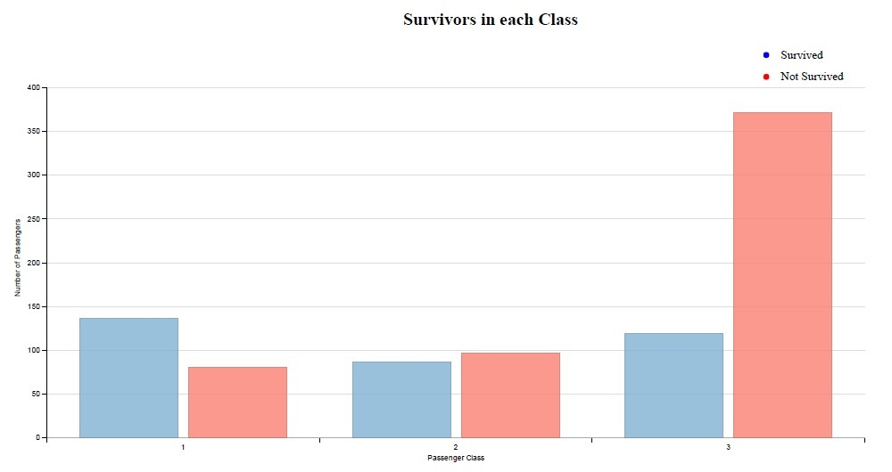
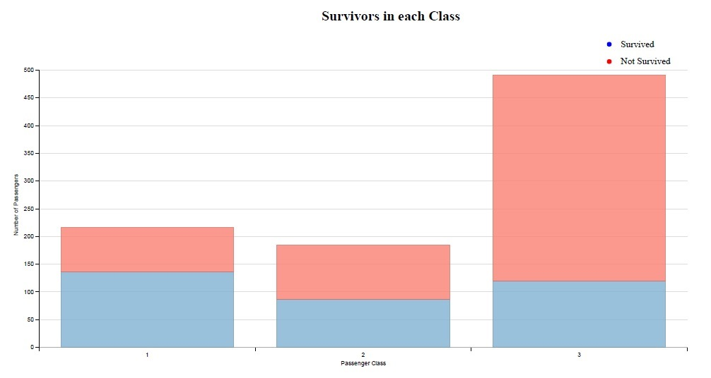
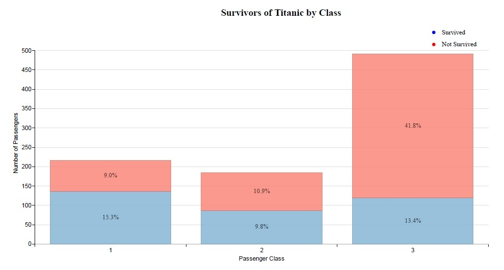
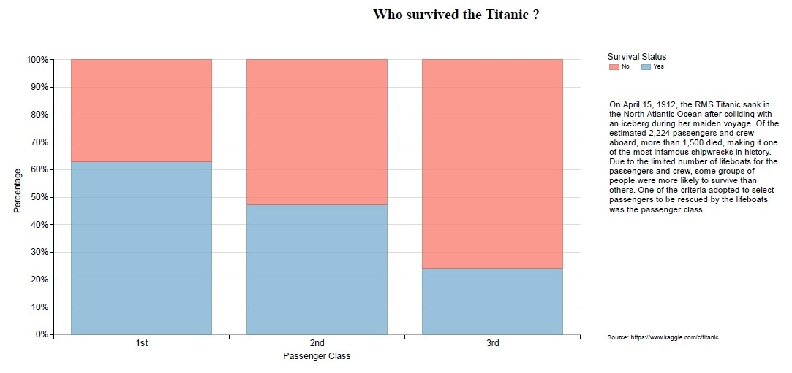

+ Data Analyst Nanodegree
+ Project 6 - Make Effective Data Visualization
+ Ricardo Yoshitomi

## Data Visualization: Survivors on the Titanic

### Summary

The objective of this project is to create a data visualization from a data set that tells a story or highlights trends or patterns in the data. I have chosen to work with the Titanic dataset. The RMS Titanic was a british passenger ship that sank in the North Atlantic Ocean after colliding with an iceberg during her maiden voyage, on 15 April 1912. Of the estimated 2,224 passengers and crew aboard, more than 1,500 died, making it one of the most infamous shipwrecks in history. The Titanic dataset contains information about each passenger and crew aboard, these information include the name, age, sex, passenger class, port of embarkation, etc. One of these information tells if the passenger had survived or not the tragedy. In this project, I will focus on the passenger class factor because it was one of the most important factors that influenced on the selection of the passengers who would be rescued by the lifeboats.

### Design

After the successive changes based on the readers feedbacks, the stacked bar chart was chosen as the final chart. The visualization compares the percentage of survivors and non-survivors of each passenger class in a xy-plane (planar variables). The x-axis shows each of the passenger class in a categorical form (1st, 2nd and 3rd classes) and the y-axis the percentage of passengers. The legend identifies the portions of survivors by color (retinal variable), the blue represents the survived portion and the red the non-survived. 

### Feedback

### Feedback 1

The first plot contains six bars, two bars for each passenger class. One of the two bars indicates the total number of survivors and the other the number of non-survivors. The first reader said that it was difficult to identify the total number of passengers of each class because the bars split the number of passengers into two parts. It was better to join the two bars of each class into a single one.

### Feedback 2

After updating the plot by taking into consideration the first feedback, I chose the stacked bar chart to reduce the number of bars in the previous plot. It made the figure clearer and allowed us to identify the number of passengers of each class. The second reader suggested increasing the letter size of the axis titles and changing the title to "Survivors of Titanic by Class".

### Feedback 3

The third reader suggested putting the percentage of each group of people over the total number of embarked passengers. Although the height of each bar already indicates the portion of survived and non-survived passengers for each class, the use of numbers (percentage) gives extra information to the reader by relating each portion of the bar to the total number of embarked passengers.

### Feedback 4

Finally, the last reader (reviewer) commented that the percentual numbers in each bar were confused and suggested to use the percentage of passengers in the y-axis instead of numbers. Using the percentage, all columns are the same size which facilitates the comparison of the chances of survival in the third class. In addition, the reader suggested changing the title to "Who 
survived the Titanic ?" because the new title characterizes an explanatory data visualization. The colors of the legend "Survived and Not Survived" were changed to become equal to the graph and a title was added to the legend. An introductory text was added to give context to the visualization. Lastly, the source of the dataset was attached at the bottom.

### Resources

+ [Dimple JS - Vert Stacked Grouped Bar](http://dimplejs.org/examples_viewer.html?id=bars_vertical_grouped_stacked)
+ [Dimple JS - Bar Labels](http://dimplejs.org/advanced_examples_viewer.html?id=advanced_bar_labels)
+ [Dimple JS - Vertical 100% Bar](http://dimplejs.org/examples_viewer.html?id=bars_vertical_stacked_100pct)
+ [Dimple JS - Aggregate Method](https://github.com/PMSI-AlignAlytics/dimple/wiki/dimple.aggregateMethod#count)
+ [Stackoverflow](https://stackoverflow.com/)
+ [Exploratory vs Explanatory Analysis](http://www.storytellingwithdata.com/blog/2014/04/exploratory-vs-explanatory-analysis)
+ [Visual Encoding Discussion](https://www.targetprocess.com/articles/visual-encoding/)
+ [Kaggle - Titanic Competition](https://www.kaggle.com/c/titanic/data)

